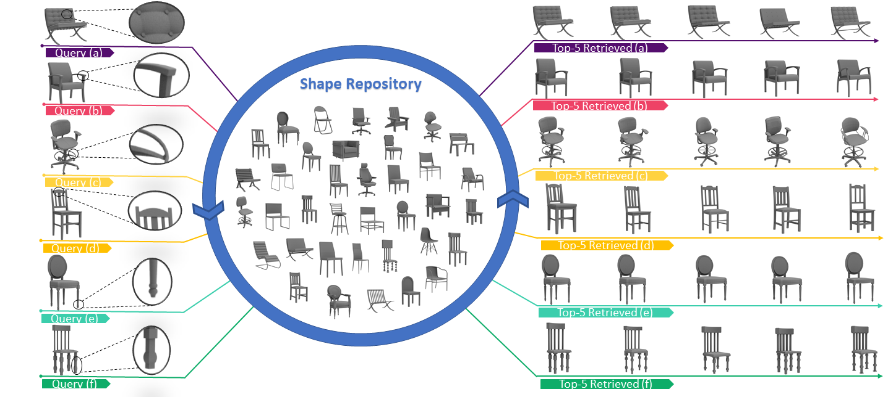
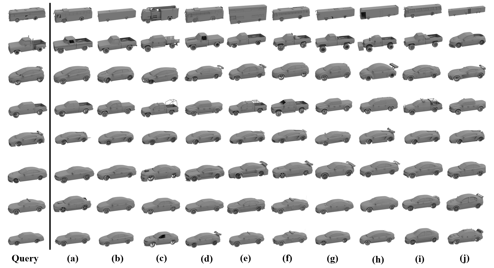

# RISA-Net: Rotation-Invariant and Structure-Aware Network for Fine-grained 3D Shape Retrieval
Rao FU, Jie Yang, Jiawei Sun, Fanglue Zhang, Yu-Kun Lai and Lin Gao.
[Project Page](https://github.com/IGLICT/RisaNET/)



### 1) Fine-grained 3D shape retrieval dataset
Please [download](https://drive.google.com/drive/folders/1BpwtlhrYfR5xGcXGoYFjo9bQFtw4nFvP?usp=sharing) our fine-grained 3D shape retrieval dataset. The dataset provides a quantatitive measure for fine-grained 3D shape retrievals. It contains 6 object categories: knife, guitar, car, plane, chair and table, each of which is further divided into dozens of categories. 
We provide 5 versions of the datset: 
1. unregistered integerated aligned model,
2. unregistered integerated perturbed model, 
3. unregistered segmented aligned model, 
4. unregistered segmented perturbed model, 
5. regitered segmented aligned model.

The train-test split label is placed in the [pre_processed_labels](./pre_processed_labels) folder. 

### 2) Training
We provide the preprocessing pipeline, preprocessed data and training codes to train the RISA-Net.

#### a) Preprocessing
We provide the preprocessed feature. Please [download](https://drive.google.com/drive/folders/1AF0rPXLsFL3o2fj0DALa0q0PICw2RPlS?usp=sharing) the preprocessed feature, and place them in the [pre_processed_features](./pre_processed_features) folder.

If you want to pre-processing your own dataset, please refer to the following pipeline. We first need to extract the base geometric feature: edge length and diheral angles from the registed segmented shapes. We also need to analyse structure information and make a lable file for triplet loss training. All preprocessing codes are placed in the [pre_processing_matlab](./pre_processing_matlab) folder. Please install [Matlab](https://www.mathworks.com/products/matlab.html) before running the code.

* To extract base geometric feature, please run: [get_edge_feature_all.m](./pre_processing_matlab/get_edge_feature_all.m).
* To analyse structure information, please run: [pca_of_each_part.m](./pre_processing_matlab/pca_of_each_part.m).
* To make label file for triplet loss, please run: [make_label_for_trip.m](./pre_processing_matlab/make_label_for_trip.m).

#### b) Learning
We provide the training pipeline placed in the [training](./training) folder. Our network is based on [Tensorflow](https://www.tensorflow.org/). To run the code, you need to set up an environment. Please run:
```
cd training;
pip install -r requirements.txt
```

We provide trained checkpoints for guitar dataset. Please [download](https://drive.google.com/drive/folders/1AF0rPXLsFL3o2fj0DALa0q0PICw2RPlS?usp=sharing) the checkpoint, and place them in the [trained_checkpoints](./trained_checkpoints) folder. If you want to get the shape descriptors of all guitars, please run:
```
python ./training/risanet.py -a 1 -b 100 -c 1e3 -d 1 -e 100 -f 2000 -x 0.3 -y 0.3 -s 32 -m 32 -n 32
```

If you want to get the shape descriptors of your own dataset, you can train RISA-Net with your own preprocessed features. The format of preprocessed features should be the same as [ours](./pre_processed_features). Then, for network training, you can use hyper-parameters as reported in our paper. Or set your own hyper-parameters. For network training, please run:
```
python ./training/risanet.py -a 1 -b 100 -c 1e3 -d 1 -e 100 -f 2000 -x 0.3 -y 0.3 -s 32 -m 32 -n 32
```

After the network is trained, you can load the shape descriptors for shape retrieval. Please run:
```
python risanet.py -r /path/to/checkpoint -k num_of_epoch
```

### 4) Evaluation

We provide the evaluation code for Precision-Recall Curve, placed in the [evaluation](./evaluation) folder. We provide the trained shape descriptors of the guitar dataset, which is placed in the [trained_checkpoints](./trained_checkpoints) folder. If you want to see the PR Curve, please run: [evaluate.m](./evaluation/evaluate.m).

### 4) Demos

Here we provide some retrieval results on several datasets.


